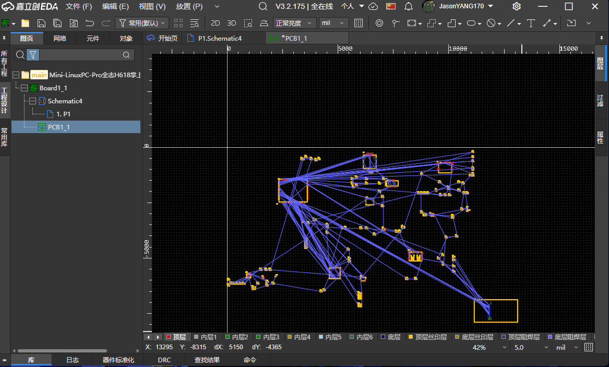
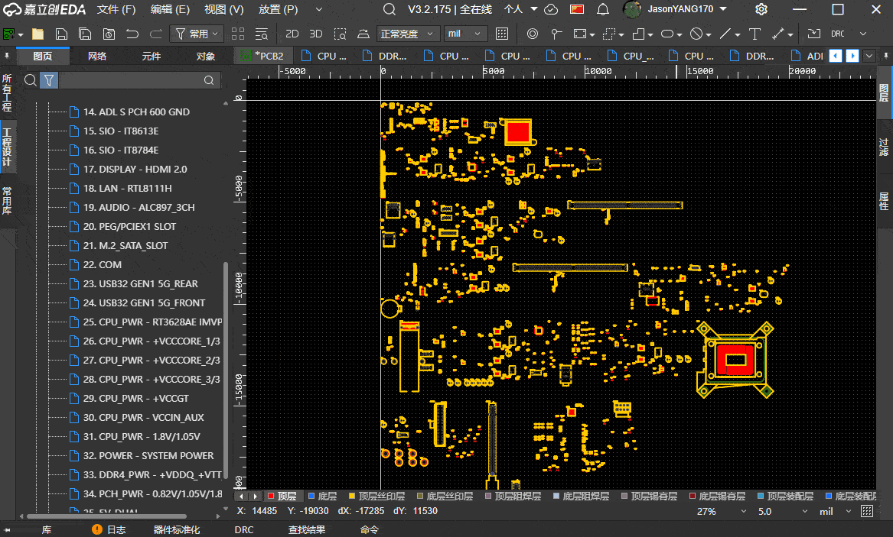

# PCB器件分组器

基于嘉立创EDA专业版的原理图到 PCB 自动分组工具。扩展读取工程中的原理图图页和 PCB 源码，将原理图矩形或图页中的器件匹配到 PCB，并生成便于整理和检查的分组区域。  
**本项目基于文档源码操作，已在[X86电脑主板](https://oshwhub.com/oshwhub/dian-nao-zhu-ban)验证，带有源码备份恢复功能，仍建议使用前备份工程**

## 主要功能

- **矩形分组**：按照原理图中的矩形归属收集器件和文本，并在 PCB 上生成对应分组。

- **图页分组**：将每个原理图图页作为一个 PCB 分组。

- **自动匹配**：优先按照位号匹配原理图与 PCB 器件，兼容 `U1A`、`U1B` 等多单元符号。
- **自动布局**：按器件位号前缀分行排列；R、C、L 类器件统一为 0°，其他器件保留原角度。
- **分组标注**：在 PCB 文档层生成分组边框、分隔线、图页名称、矩形名称和原理图文本。
- **安全写入**：写入前请求确认，写入后重新读取并校验器件坐标；校验失败时自动恢复原始源码。
- **一键回退**：通过“回退分组源码”恢复最近一次分组操作前的 PCB 源码备份。

## 使用方法

1. 保存当前工程，建议另外创建一份工程副本。
2. 从扩展菜单选择“矩形分组”或“图页分组”。
3. 检查确认窗口中将移动的器件数和将生成的分组数。
4. 点击“确定”，等待扩展完成源码写入、回读校验和 PCB 保存。
5. 在 PCB 中检查器件、丝印位号、分组边框及文本的位置。
6. 若结果不符合预期，保持目标 PCB 打开并执行“回退分组源码”。

每次新的分组操作只保留一份最近备份；再次执行分组会覆盖此前的备份。
